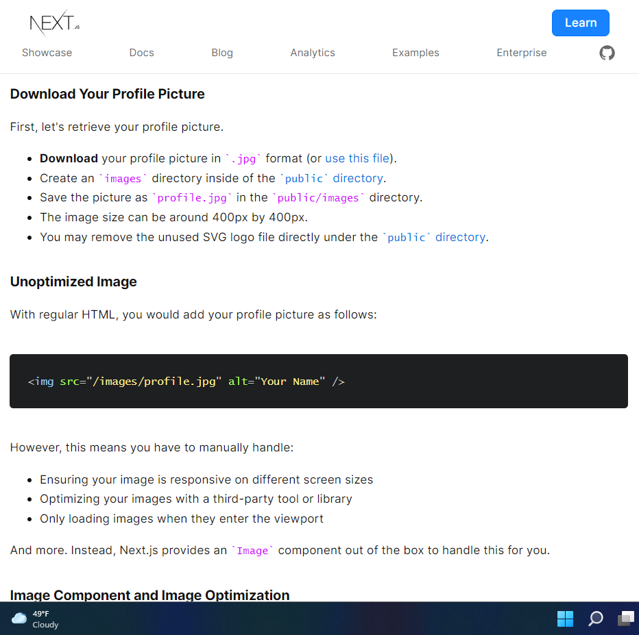

# archetypes by awedjob for flytv hackathon project

> "I would have preferred there to images embedded in this document but the links are good enough for now."
>
> - awedjob's [arch-sketches.md](https://github.com/leelakrishnan/FlyTV/blob/main/arch-sketches.md)

## how to embed an image into

1. markdown.md files
1. nextjs dApp
1. mainmap

**bold**

- Ensuring your image is responsive on different screen sizes
- Optimizing your images with a third-party tool or library
- Only loading images when they enter the viewport

### Next.js Image component out of the box

1. next/image is an extension of HTML `` element, **\_\_\_\_\_\_\_** for the modern web.
1. avoid shipping large images to devices with a smaller viewport.
1. even external data source images can be optimized by Next, on demand, as users request them
